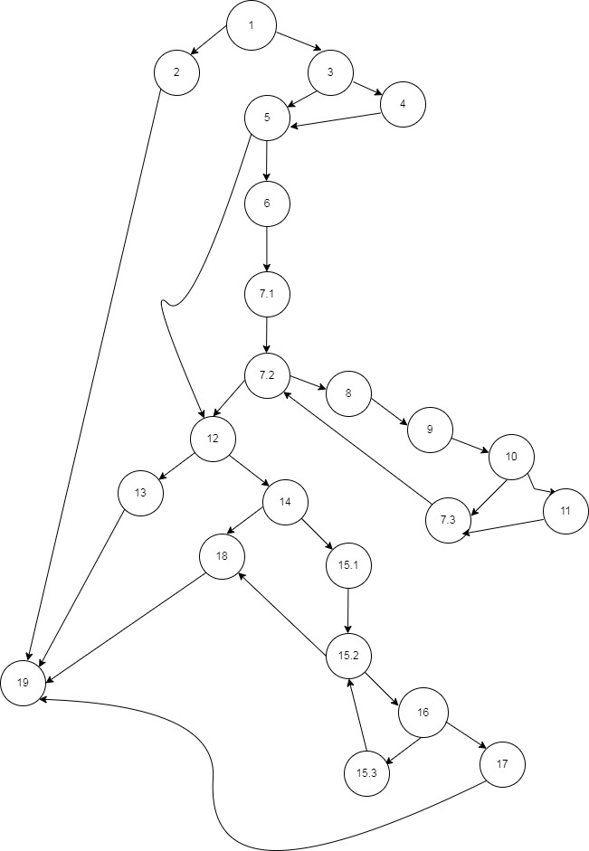

# Втора лабораториска вежба по Софтверско инженерство

## , бр. на индекс 

###  Control Flow Graph

### Цикломатска комплексност

Цикломатската комплекснст за дадениот код е 11.
Се добива на 3 начини.
### 1 начин: преку бројот на региони кои се препознаваат во Control Flow Graph
### 2 начин: со вкупниот број на врски(ребра) помеѓу јазлите и вкупниот број на јазли. Формула V(G) = E – N + 2, каде N е бројот на врски(ребра), а N e бројот на јазли
### 3 начин: преку вкупниот број на предикатни јазли V(G) = P + 1

### Тест случаеви според Every branch критериумот

Според Every Branch критериумот, потребно е да ги напишеме и тестираме сите можни патеки преку кодот. Во овој случај, имаме неколку услови и можни патеки кои треба да ги провериме. Во продолжение, ќе ги наведам тест случаите и ќе ги објаснам секој од нив:

##### Тест 1: 
Тест случај кога корисникот (user) е null:

Влезни податоци: user = null, allUsers = [user1, user2, user3]
Очекуван резултат: RuntimeException со порака "Mandatory information missing!"

##### Тест 2: 
Тест случај кога лозинката (password) е null:

Влезни податоци: user = User("username", null, "email@example.com"), allUsers = [user1, user2, user3]
Очекуван резултат: RuntimeException со порака "Mandatory information missing!"

##### Тест 3: 
Тест случај кога е-поштата (email) е null:

Влезни податоци: user = User("username", "password", null), allUsers = [user1, user2, user3]
Очекуван резултат: RuntimeException со порака "Mandatory information missing!"

##### Тест 4: 
Тест случај кога корисничкото име (username) е null:

Влезни податоци: user = User(null, "password", "email@example.com"), allUsers = [user1, user2, user3]
Очекуван резултат: user треба да го постави username на вредноста на email и врати true

##### Тест 5: 
Тест случај кога е-поштата (email) не содржи символи '@' и '.':

Влезни податоци: user = User("username", "password", "email"), allUsers = [user1, user2, user3]`
Очекуван резултат: same треба да биде 1 и да се изврши наредбата return false на крајот на функцијата

##### Тест 6: 
Тест случај кога е-поштата (email) содржи '@' и '.' и постои друг корисник со иста е-пошта:

Влезни податоци: user = User("username", "password", "email@example.com"), allUsers = [user1, user2, user3](каде штоuser2има иста е-пошта како иuser`)
Очекуван резултат: same треба да биде 2 и да се изврши наредбата return false на крајот на функцијата

##### Тест 7: 
Тест случај кога е-поштата (email) содржи '@' и '.' и не постои друг корисник со иста е-пошта, но постои корисник со исто корисничко име:

Влезни податоци: user = User("username", "password", "email@example.com"), allUsers = [user1, user2, user3](каде штоuser3има исто корисничко име како иuser`)
Очекуван резултат: same треба да биде 2 и да се изврши наредбата return false на крајот на функцијата

##### Тест 8: 
Тест случај кога е-поштата (email) содржи '@' и '.' и не постои друг корисник со иста е-пошта и корисник со исто корисничко име, но лозинката (password) содржи корисничкото име:

Влезни податоци: user = User("username", "username123", "email@example.com"), allUsers = [user1, user2, user3]`
Очекуван резултат: password содржи username во себе и да се врати false

##### Тест 9: 
Тест случај кога е-поштата (email) содржи '@' и '.' и не постои друг корисник со иста е-пошта и корисник со исто корисничко име, лозинката (password) не содржи корисничкото име, но има помалку од 8 карактери:

Влезни податоци: user = User("username", "pass", "email@example.com"), allUsers = [user1, user2, user3]`
Очекуван резултат: password има помалку од 8 карактери и да се врати false

##### Тест 10: 
Тест случај кога е-поштата (email) содржи '@' и '.' и не постои друг корисник со иста е-пошта и корисник со исто корисничко име, лозинката (password) не содржи корисничкото име, има 8 или повеќе карактери, но не содржи специјални знаци:

Влезни податоци: user = User("username", "password123", "email@example.com"), allUsers = [user1, user2, user3]`
Очекуван резултат: password не содржи специјални знаци и да се врати false

##### Тест 11: 
Тест случај кога е-поштата (email) содржи '@' и '.' и не постои друг корисник со иста е-пошта и корисник со исто корисничко име, лозинката (password) не содржи корисничкото име, има 8 или повеќе карактери и содржи специјален знак:
Влезни податоци: user = User("username", "pass@word123", "email@example.com"), allUsers = [user1, user2, user3]`
Очекуван резултат: password содржи специјален знак и same е 0, па да се врати true

Овие тест случаи ги покриваат сите можни патеки преку кодот и ги тестираат сите услови и наредби.